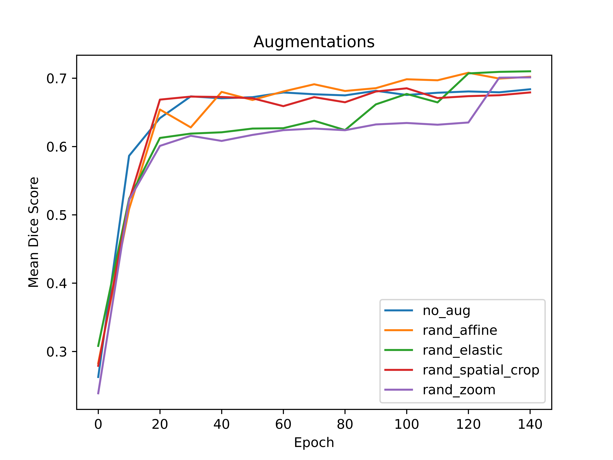
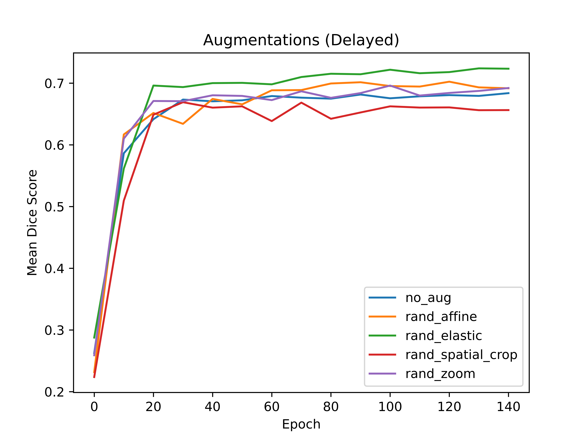
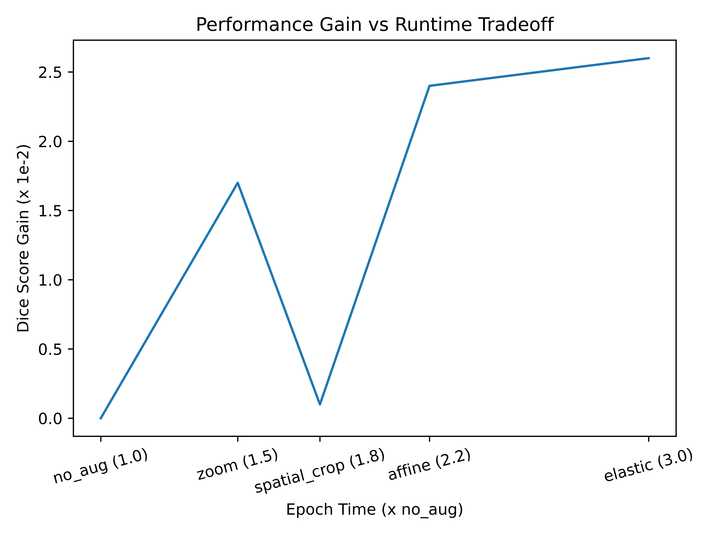
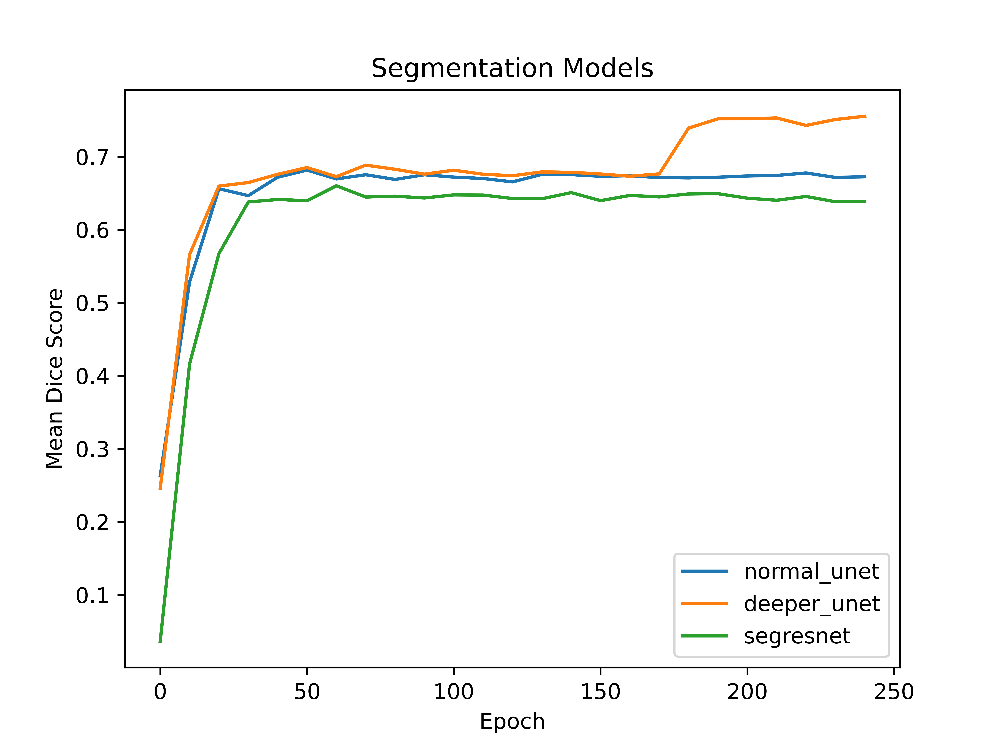
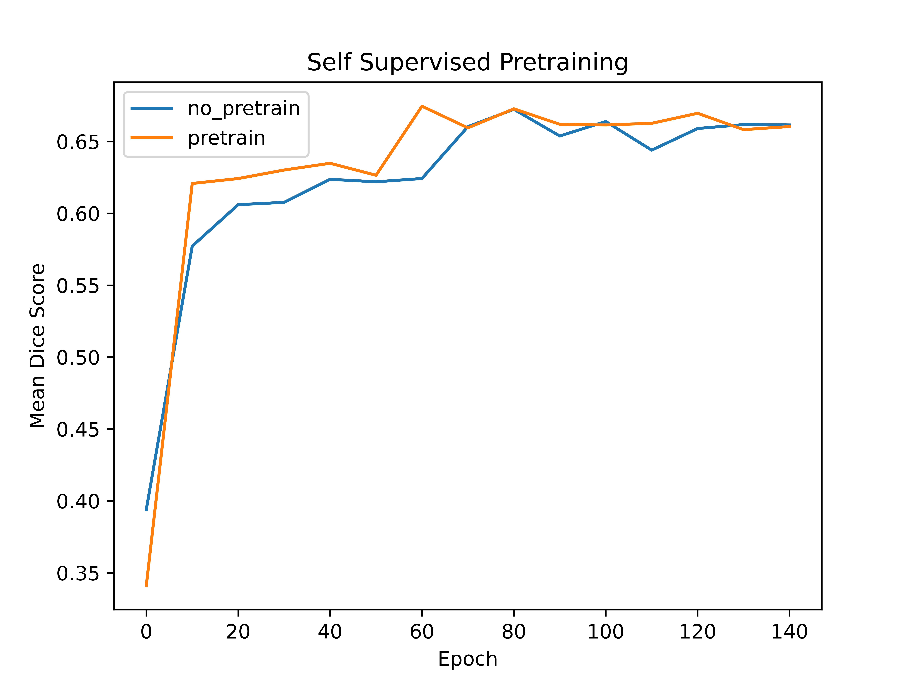
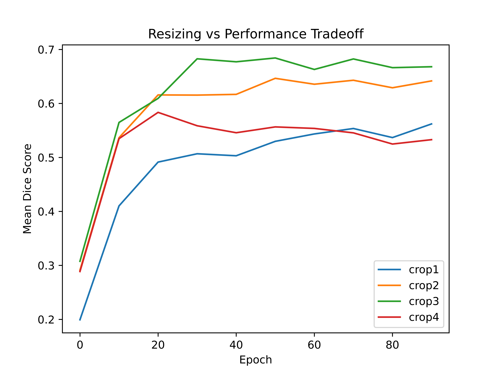
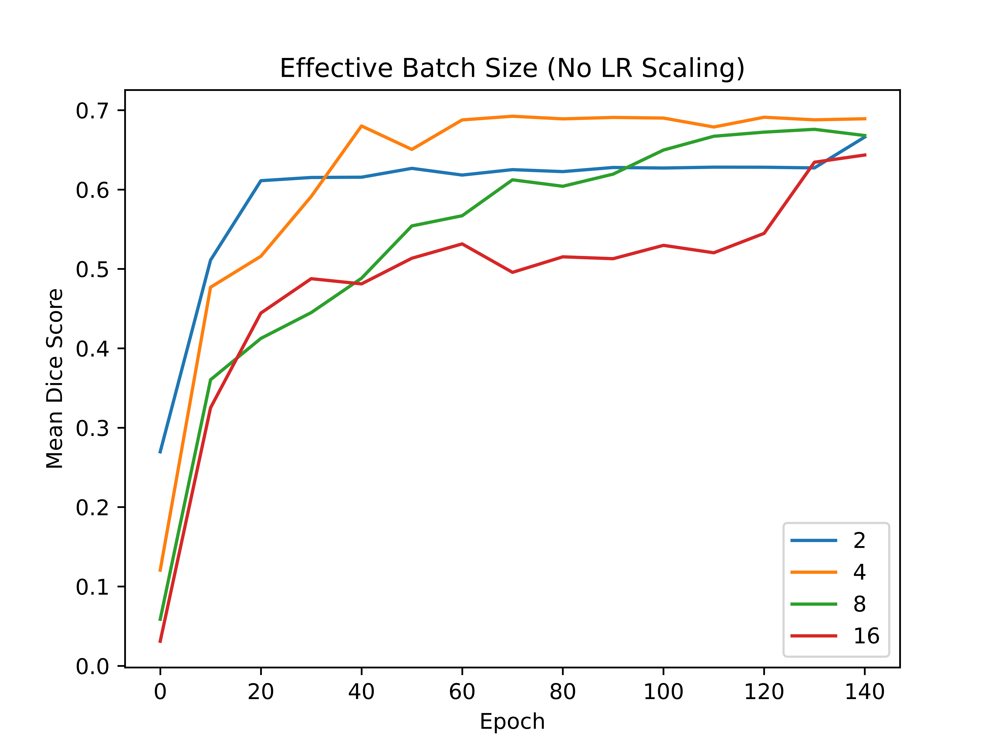
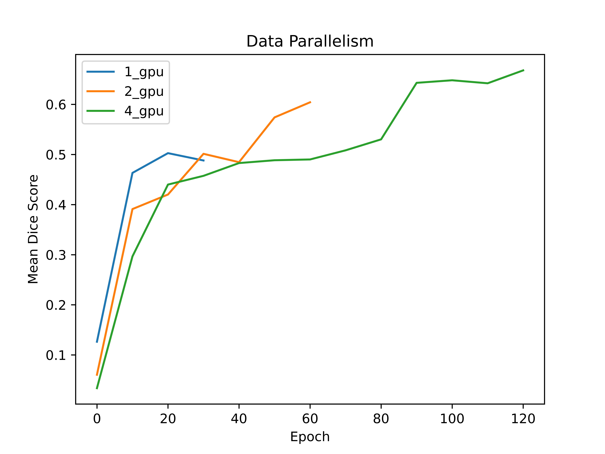

# Multi-organ Segmentation in Head and Neck Cancer

This is the final project for the Deep Learning Systems course at NYU Courant. The goal is to perform multi-organ segmentation for head and neck cancer.

## Report
Report containing detailed insights can be found [here](https://github.com/mok232/head_and_neck_segmentation/blob/main/report_v2.pdf)
## Data
Please download the preprocessed data from [here](https://github.com/wentaozhu/AnatomyNet-for-anatomical-segmentation).

## Code Structure
The repo is organized as follows. Each directory is dedicated to a particular set of experiments and contains the code files (`.py`) and the log files (`.log`) obtained from the corresponding experiments. In particular, the following structure is maintained:

```
|
|- augmentation_model -- contains code and results for the baseline experiment, different models (unet, deeper unet, segresnet), different augmentations (affine, elastic, spatial crop, zoom) with and without delay
|- data_parallel -- contains code and results for the data parallelism experiments with 1, 2 and 4 GPUs
|- effective_bsz -- contains code and results for the effective batch size experiments with 2, 4, 8 and 16 effective batch sizes
|- input_resize -- contains code and results for understanding the impact of resizing input CT scans on model performance
|- ssl -- contains code and results of pretrained model from Models Genesis
|- visualizations -- contains utility code for creating the different plots
```

## Experiments

### Baseline
In order to run a baseline experiment with UNet model and no augmentation, run the following:
```
cd augmentation_model
python train_augmentation.py --model unet --num_epochs 250 --exp_dir baseline
```

### Augmentations
For a visualization of the different augmentations, refer to the [notebook](augmentation_model/augmentations.ipynb). To train the UNet model with 4 different augmentations (without delay i.e. start augmentation from the 1st epoch), run the following commands:

```
cd augmentation_model
python train_augmentation.py --model unet --num_epochs 250 --transform rand_affine --exp_dir aug_exp_rand_affine
python train_augmentation.py --model unet --num_epochs 250 --transform rand_elastic --exp_dir aug_exp_rand_elastic
python train_augmentation.py --model unet --num_epochs 250 --transform rand_spatial_crop --exp_dir aug_exp_rand_spatial_crop
python train_augmentation.py --model unet --num_epochs 250 --transform rand_zoom --exp_dir aug_exp_rand_zoom
```


To train the UNet model with 4 different augmentations (with delay i.e. start augmentation after the first 40 epochs), run the following commands:

```
cd augmentation_model
python train_augmentation.py --model unet --num_epochs 250 --transform rand_affine --delay --exp_dir aug_delayed_rand_affine
python train_augmentation.py --model unet --num_epochs 250 --transform rand_elastic --delay --exp_dir aug_delayed_rand_elastic
python train_augmentation.py --model unet --num_epochs 250 --transform rand_spatial_crop --delay --exp_dir aug_delayed_rand_spatial_crop
python train_augmentation.py --model unet --num_epochs 250 --transform rand_zoom --delay --exp_dir aug_delayed_rand_zoom
```


The plot below shows the tradeoff between increase in performance vs increase in training time for the different augmentations:


### Models
To run experiments for the 3 different models (UNet, Deeper UNet, SegResNet), run the following commands:
```
cd augmentation_model
python train_augmentation.py --model unet --num_epochs 250 --exp_dir model_exp_normal_unet
python train_augmentation.py --model deeper_unet --num_epochs 250 --exp_dir model_exp_deeper_unet
python train_augmentation.py --model segresnet --num_epochs 250 --exp_dir model_exp_segresnet
```



### Self-supervised Learning
To train the segmentation model based on the pretrained model from [Models Genesis](https://github.com/MrGiovanni/ModelsGenesis), run the following code. Note that the input needs to be resized in order to make it compatible with the pretrained model from Models Genesis. `crop1` resizes it to `[64, 128, 128]` whereas `crop2` resizes it to `[128, 128, 64]`.
```
cd ssl
python train_ssl.py --transform crop1 --exp_dir no_pretrain_crop1
python train_ssl.py --transform crop1 --pretrain --exp_dir pretrain_crop1
python train_ssl.py --transform crop2 --exp_dir no_pretrain_crop2
python train_ssl.py --transform crop2 --pretrain --exp_dir pretrain_crop2
```



### Input Resize
In order to observe the impact of resizing the input CT scan to different sizes on the model performance, run the following commands. In terms of size, `crop1` > `crop2` > `crop3` > `crop4`. `crop1` is 1.4x the average size `[78, 206, 164]`, `crop2` is 1.2x, `crop3` is 1.0x and `crop4` is 0.8x the average size of the CT scan.
```
cd input_resize
python train_resize.py --transform crop1 --exp_dir resize_crop1
python train_resize.py --transform crop2 --exp_dir resize_crop2
python train_resize.py --transform crop3 --exp_dir resize_crop3
python train_resize.py --transform crop4 --exp_dir resize_crop4
```



### Effective Batch Size
In order to observe the impact of effective batch size on the segmentation performance, run the following commands:
```
cd effective_bsz
python train_effective_bsz.py --effective_bsz 2 --num_epochs 150 --exp_dir effective_bsz_exp_2
python train_effective_bsz.py --effective_bsz 4 --num_epochs 300 --exp_dir effective_bsz_exp_4
python train_effective_bsz.py --effective_bsz 8 --num_epochs 600 --exp_dir effective_bsz_exp_8
python train_effective_bsz.py --effective_bsz 16 --num_epochs 1200 --exp_dir effective_bsz_exp_16
```



### Data Parallelism
In order to run the data parallelism experiments on multiple GPUs, run the following commands. Note that the input CT scans need to be resized to the same size in order to use a batch size greater than 1 on a single GPU. In this case, we resize each CT scan to the average size of the CT scans in the training set i.e. `[78, 206, 164]`.
```
cd data_parallel
CUDA_VISIBLE_DEVICES=0 python train_data_parallel.py --num_epochs 150 --exp_dir distributed_exp_1_gpu
CUDA_VISIBLE_DEVICES=0,1 python train_data_parallel.py --num_epochs 300 --exp_dir distributed_exp_2_gpu
CUDA_VISIBLE_DEVICES=0,1,2,3 python train_data_parallel.py --num_epochs 600 --exp_dir distributed_exp_4_gpu
```



All the commands to replicate the experiments are also provided in the sbatch scripts in the respective directories.

## Resources
The slides can be found [here](https://drive.google.com/file/d/1ilodckjwQs7pH8Am7qkWAtH2fdfSabBx/view). And [here](https://drive.google.com/file/d/1txsvAAPC3Gp4xkhGLtwawJvASeVWxGBx/view?usp=sharing) is a 20-min video describing the project. The results can also be visualized using Tensorboard [1](https://tensorboard.dev/experiment/oyNuDrRvSaqDobsk0G3JpA/#scalars), [2](https://tensorboard.dev/experiment/Rgl1SEg3RBSM9awXHqOrhw/#scalars), [3](https://tensorboard.dev/experiment/nojj1YgSQeWIqsbGxIwBoA/#scalars), [4](https://tensorboard.dev/experiment/nWlKYLwVSxKHD0R1QgCY5g/#scalars).
